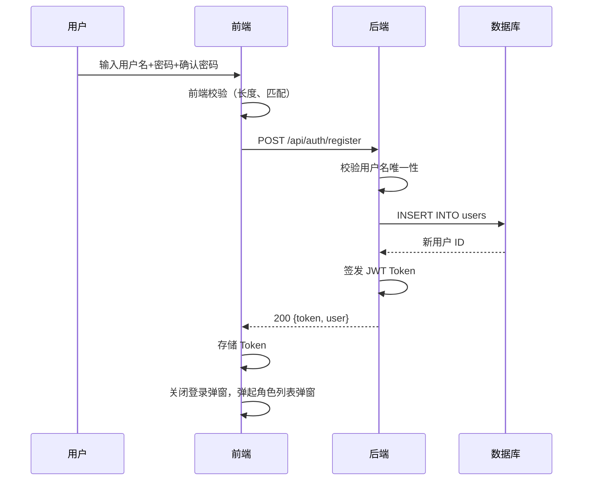
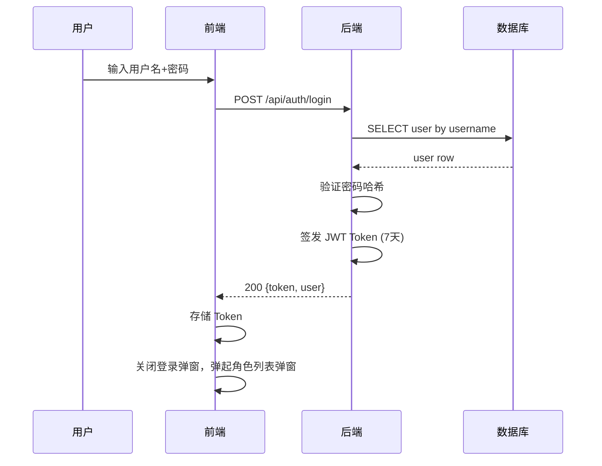
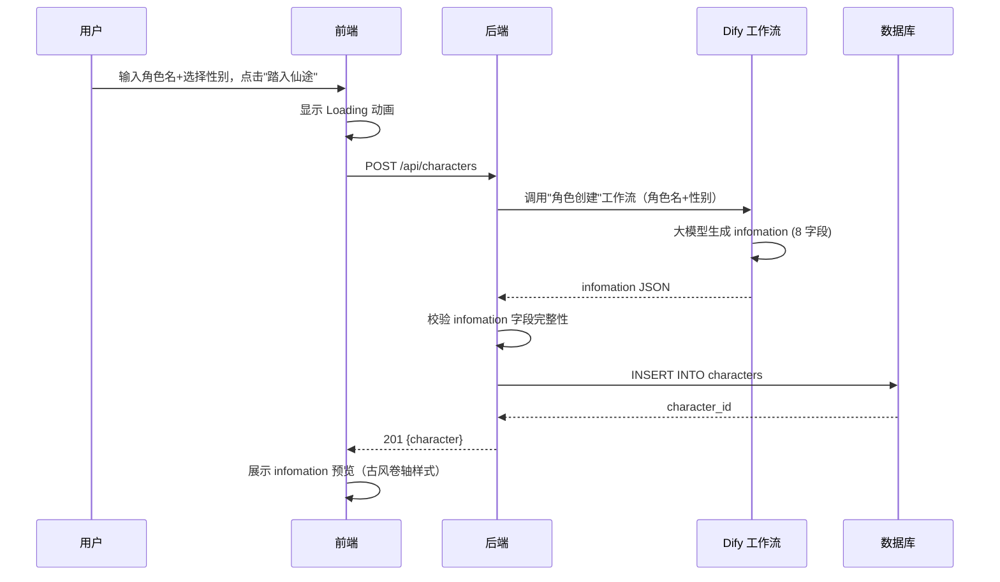
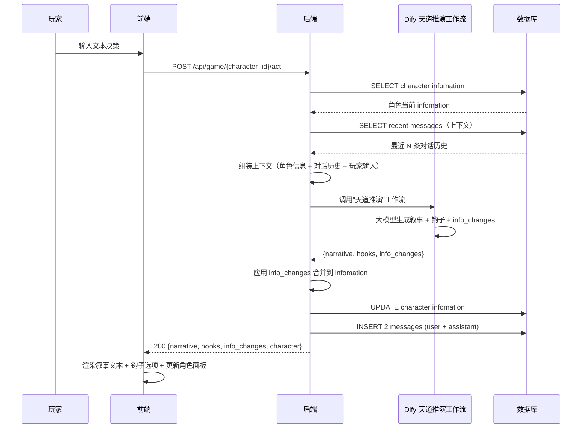
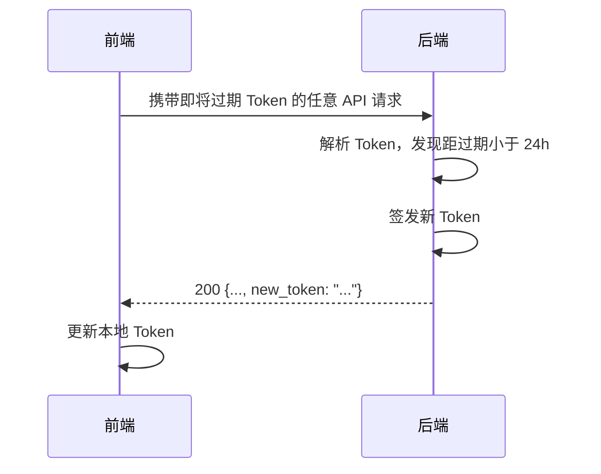

# 无敌  (Invencia) —— 概要设计文档

> 版本：v1.1
> 日期：2026-05-25
> 前置文档：requirements.md（需求分析）、project-status.md（项目状态）
> 变更记录：
> - v1.1：AI 编排平台从 Dify 切换至 Dify（支持 Agent 原生 function calling）
- v1.0：初版概要设计

---

> **文档边界**：本文档为概要设计，回答"用什么技术做"。不包含逐行代码、Prompt 精确措辞、CSS 样式细节。详细规则见 [docs-guide.md](docs-guide.md)。

---

## 一、技术选型

### 1.1 选型总览

| 层次 | 选择 | 理由 |
|------|------|------|
| 前端 | HTML5 + CSS3 + Vanilla JS | 无构建工具依赖，零运行时开销，足够承载文字 RPG 的 UI 复杂度 |
| 前端路由 | Hash 路由  (SPA) | 无需服务端配置即可实现无刷新页面切换 |
| 后端框架 | FastAPI  (Python) | 原生 async 支持（AI API 调用场景关键），自动 OpenAPI 文档，轻量 |
| ASGI 服务 | Uvicorn | FastAPI 推荐搭配，高性能 |
| 数据库 | SQLite | 单文件零配置，与"单文件数据库"决策一致，MVP 阶段完全足够 |
| 数据库驱动 | Python sqlite3 标准库 | 零额外依赖 |
| AI 编排 | Dify 平台 | Workflow（角色创建）+ Chatflow Agent（天道推演），原生 function calling |
| AI 模型 | DeepSeek / Qwen 等国产大模型 | 降低成本，中文原生支持。Dify 内置多种模型接入 |
| 认证方案 | JWT（7天有效期 + 24h自动续期） | 无状态认证，适合 SPA 架构 |
| 部署 | Nginx + Uvicorn | 反向代理 + 静态资源服务 + ASGI 转发 |

### 1.2 选型理由详述

**为什么选择 FastAPI？**

- 异步原生支持：核心游戏循环需要调用外部 AI API，同步阻塞会导致吞吐量极低
- 自动文档：开发阶段可用 /docs 直接调试 API
- 类型校验：Pydantic 模型自动请求/响应验证，减少样板代码
- 生态成熟：中间件、依赖注入、异常处理均内置

**为什么选择 SQLite？**

- 单文件：备份只需复制一个文件
- 零配置：无需安装数据库服务
- WAL 模式：支持并发读，满足 MVP 并发需求
- 迁移成本低：若未来扩展，可平滑迁移至 PostgreSQL

**为什么使用 Dify 工作流而非自建 AI 编排？**

- 工作流配置化：System Prompt、上下文组装、输出解析均由工作流完成，后端只需调用 API
- 快速迭代：调整 Prompt 无需改代码或重新部署
- 内置 JSON 输出解析：减少后端处理"AI 输出格式不稳定"的风险

---

## 二、架构分层

### 2.1 分层架构图

```
+---------------------------------------------------------+
|                    表示层  (Frontend)                      |
|                                                         |
|  +----------+  +----------+  +----------------------+   |
|  | 主页      |  | 游戏界面  |  | 弹窗（登录/角色列表/  |   |
|  | /         |  | /game/*  |  | 创建角色）            |   |
|  +----------+  +----------+  +----------------------+   |
|                                                         |
|  职责：页面渲染、用户交互、前端路由守卫、Token 管理       |
+--------------------------+------------------------------+
                           | HTTP  (JSON) / Fetch API
+--------------------------+------------------------------+
|                    接口层  (API Gateway)                   |
|                                                         |
|  +--------------------------------------------------+   |
|  |              FastAPI 路由 + 中间件                  |   |
|  |  /api/auth/*    /api/worlds/*    /api/characters/* |   |
|  |  /api/game/*                                      |   |
|  +--------------------------------------------------+   |
|  +----------+  +----------+  +--------------------+     |
|  | CORS 中间件|  | Auth 中间件|  | 异常处理中间件      |     |
|  +----------+  +----------+  +--------------------+     |
|                                                         |
|  职责：请求路由、认证校验、参数验证、异常统一包装         |
+--------------------------+------------------------------+
                           |
+--------------------------+------------------------------+
|                    业务层  (Service Layer)                 |
|                                                         |
|  +----------+ +----------+ +----------+ +----------+   |
|  |AuthService| |CharService| |GameService| |WorldService|   |
|  | 注册/登录  | | 角色CRUD  | | 叙事引擎  | | 世界配置  |   |
|  | 凭证管理  | | AI 生成   | | info维护  | |           |   |
|  +----------+ +----------+ +----------+ +----------+   |
|                                                         |
|  职责：核心业务逻辑、流程编排、业务规则校验               |
+--------------------------+------------------------------+
                           |
+--------------------------+------------------------------+
|                    数据层  (Data Access)                   |
|                                                         |
|  +--------------------------------------------------+   |
|  |                  SQLite 数据库                      |   |
|  |  users | characters | world_config | messages      |   |
|  +--------------------------------------------------+   |
|                                                         |
|  职责：数据持久化、查询、事务管理                        |
+---------------------------------------------------------+

+---------------------------------------------------------+
|                  外部集成层  (External)                    |
|                                                         |
|  +------------------+  +--------------------------+     |
|  | Dify 工作流 API   |  | 国产大模型 API            |     |
|  |  (角色创建+天道推演) |  |  (OpenAI SDK 兼容)         |     |
|  +------------------+  +--------------------------+     |
|                                                         |
|  职责：AI 能力调用封装、重试、降级                       |
+---------------------------------------------------------+
```

### 2.2 分层职责

| 层 | 包含 | 不包含 |
|------|------|--------|
| 表示层 | HTML 模板、CSS 样式、JS 交互逻辑、路由 | 业务逻辑、数据库操作 |
| 接口层 | 路由定义、请求参数校验、认证拦截 | 业务规则判断 |
| 业务层 | 注册/登录逻辑、角色生成编排、叙事流程 | HTTP 请求/响应处理 |
| 数据层 | CRUD 操作、连接管理、事务 | 业务规则 |
| 外部集成层 | Dify API 调用、模型重试、响应解析 | 游戏规则 |

---

## 三、模块划分

### 3.1 目录结构

```
invencia/
├── frontend/                  # 表示层
│   ├── index.html             # 入口 HTML（SPA 壳）
│   ├── css/
│   │   └── style.css          # 全局样式（黑底古风）
│   └── js/
│       ├── router.js          # Hash 路由
│       ├── api.js             # API 请求封装
│       ├── auth.js            # Token 管理
│       ├── pages/
│       │   ├── home.js        # 主页逻辑
│       │   └── game.js        # 游戏界面逻辑
│       └── modals/
│           ├── login.js       # 登录/注册弹窗
│           ├── char-list.js   # 角色列表弹窗
│           └── char-create.js # 创建角色弹窗
│
├── backend/                   # 接口层 + 业务层 + 数据层
│   ├── main.py                # FastAPI 应用入口
│   ├── config.py              # 配置管理
│   ├── middleware/
│   │   ├── auth.py            # 认证中间件
│   │   └── error_handler.py   # 全局异常处理
│   ├── routers/
│   │   ├── auth.py            # /api/auth/*
│   │   ├── worlds.py          # /api/worlds/*
│   │   ├── characters.py      # /api/characters/*
│   │   └── game.py            # /api/game/*
│   ├── services/
│   │   ├── auth_service.py    # 认证业务逻辑
│   │   ├── char_service.py    # 角色业务逻辑
│   │   ├── game_service.py    # 叙事引擎
│   │   └── world_service.py   # 世界配置
│   ├── repositories/
│   │   ├── user_repo.py       # 用户表操作
│   │   ├── char_repo.py       # 角色表操作
│   │   ├── world_repo.py      # 世界配置表操作
│   │   └── message_repo.py    # 消息表操作
│   ├── external/
│   │   ├── dify_client.py     # Dify 工作流调用封装
│   │   └── llm_client.py      # 大模型 SDK 封装
│   └── db/
│       ├── connection.py      # 数据库连接管理
│       └── migrations.py      # 表结构初始化
│
└── data/
    └── invencia.db            # SQLite 数据库文件
```

### 3.2 前端模块职责

| 模块 | 文件 | 职责 |
|------|------|------|
| 路由 | router.js | SPA Hash 路由、路由守卫（未登录拦截） |
| API 封装 | api.js | Fetch 封装、Token 自动附加、错误统一处理 |
| 认证 | auth.js | Token 存储/读取/清除、过期判断 |
| 主页 | pages/home.js | 渲染世界列表、世界详情预览、示例叙事 |
| 游戏界面 | pages/game.js | 对话区渲染、输入框、角色面板侧栏、消息管理 |
| 登录弹窗 | modals/login.js | 登录/注册表单切换、表单校验 |
| 角色列表 | modals/char-list.js | 角色列表展示、选择/创建角色 |
| 创建角色 | modals/char-create.js | 角色名/性别输入、AI 生成加载、infomation 预览 |

### 3.3 后端模块职责

| 模块 | 文件 | 职责 |
|------|------|------|
| 认证路由 | routers/auth.py | 注册/登录/续期 API 端点 |
| 世界路由 | routers/worlds.py | 世界列表查询 |
| 角色路由 | routers/characters.py | 角色 CRUD、AI 生成触发 |
| 游戏路由 | routers/game.py | 核心叙事接口、消息历史 |
| 认证服务 | services/auth_service.py | 密码哈希、Token 签发/验证/续期 |
| 角色服务 | services/char_service.py | 角色创建流程编排、infomation 更新 |
| 游戏服务 | services/game_service.py | 上下文组装、Dify 调用编排、响应解析 |
| 世界服务 | services/world_service.py | 世界配置加载、System Prompt 管理 |
| Dify 客户端 | external/dify_client.py | Dify API 调用、重试、超时 |
| LLM 客户端 | external/llm_client.py | 大模型 API 调用（OpenAI SDK 兼容） |

---

## 四、数据流设计

### 4.1 用户注册流程



### 4.2 用户登录流程



### 4.3 角色创建流程（AI 生成）



### 4.4 核心游戏循环



### 4.5 Token 续期流程



---

## 五、API 设计

### 5.1 认证相关

| 方法 | 路径 | 认证 | 说明 |
|------|------|------|------|
| POST | /api/auth/register | 无 | 用户注册，返回 Token |
| POST | /api/auth/login | 无 | 用户登录，返回 Token |
| POST | /api/auth/refresh | 必须 | 手动刷新 Token |

**POST /api/auth/register**

```
请求体：{ username, password, password_confirm }
响应 201：{ token, user: { id, username } }
异常 409：用户名已存在
异常 422：参数校验失败
```

**POST /api/auth/login**

```
请求体：{ username, password }
响应 200：{ token, user: { id, username } }
异常 401：用户名或密码错误
```

### 5.2 世界配置

| 方法 | 路径 | 认证 | 说明 |
|------|------|------|------|
| GET | /api/worlds | 无 | 返回所有可用世界列表 |

**GET /api/worlds**

```
响应 200：{
  worlds: [
    { id, name, display_name, description, summary, cover_image, tags }
  ]
}
```

### 5.3 角色管理

| 方法 | 路径 | 认证 | 说明 |
|------|------|------|------|
| GET | /api/characters | 必须 | 查询当前用户所有角色 |
| POST | /api/characters | 必须 | 创建角色（触发 AI 生成） |
| GET | /api/characters/{id} | 必须 | 查询角色详情（含 infomation） |
| PUT | /api/characters/{id} | 必须 | 更新角色 infomation |
| DELETE | /api/characters/{id} | 必须 | 删除角色 |

**GET /api/characters**

```
查询参数：world_id  (可选，按世界过滤)
响应 200：{ characters: [{ id, name, gender, world_id, created_at }] }
```

**POST /api/characters**

```
请求体：{ name, gender, world_id }
响应 201：{ character: { id, name, gender, infomation, world_id, created_at } }
异常 400：角色数量已达上限（3个）
异常 503：AI 生成失败
```

**GET /api/characters/{id}**

```
响应 200：{ character: { id, name, gender, world_id, infomation, created_at, updated_at } }
异常 404：角色不存在
异常 403：角色不属于当前用户
```

### 5.4 游戏核心

| 方法 | 路径 | 认证 | 说明 |
|------|------|------|------|
| POST | /api/game/{character_id}/act | 必须 | 核心交互：提交玩家决策，获取 AI 叙事 |
| GET | /api/game/{character_id}/messages | 必须 | 获取对话历史 |

**POST /api/game/{character_id}/act**

```
请求体：{ content: "玩家自由文本输入" }
响应 200：{
  narrative: "天道生成的叙事文本",
  hooks: ["钩子1", "钩子2", "..."],
  info_changes: { ...部分 infomation 字段更新 },
  character: { ...完整 infomation }
}
异常 404：角色不存在
异常 503：AI 服务不可用
```

**GET /api/game/{character_id}/messages**

```
查询参数：before_id  (分页游标), limit  (每页条数，默认 50)
响应 200：{
  messages: [{ id, role, content, metadata, created_at }],
  has_more: true/false
}
```

### 5.5 通用规范

- 所有响应统一包装为 { success: true, data: {...} } 或 { success: false, error: { code, message } }
- 认证通过 `Authorization: Bearer <token>` 请求头传递
- 错误码体系：401（未认证）、403（无权限）、404（不存在）、409（冲突）、422（参数错误）、503（服务不可用）

---

## 六、数据库设计

### 6.1 表关系图

```
+----------+       +--------------+       +--------------+
|  users   |       |  characters  |       |   messages   |
+----------+       +--------------+       +--------------+
| id (PK)  |--1:N--| user_id (FK) |--1:N--| character_id  |
| username |       | id (PK)      |       | (FK)         |
| password |       | world_id (FK)|       | id (PK)      |
| ...      |       | name         |       | role         |
+----------+       | gender       |       | content      |
                   | infomation   |       | metadata     |
                   | ...          |       | ...          |
                   +------+-------+       +--------------+
                          |
                          | N:1
                   +------+----------+
                   |  world_config   |
                   +-----------------+
                   | id (PK)         |
                   | name            |
                   | display_name    |
                   | description     |
                   | system_prompt   |
                   | ...             |
                   +-----------------+
```

### 6.2 用户表（users）

| 字段 | 类型 | 约束 | 说明 |
|------|------|------|------|
| id | INTEGER | PK, AUTOINCREMENT | 用户唯一标识 |
| username | TEXT | NOT NULL, UNIQUE | 用户名（2-20 字符） |
| password_hash | TEXT | NOT NULL | 密码哈希值 |
| created_at | TEXT | NOT NULL, DEFAULT CURRENT_TIMESTAMP | 注册时间 |
| updated_at | TEXT | NOT NULL, DEFAULT CURRENT_TIMESTAMP | 更新时间 |
| del_flag | INTEGER | NOT NULL, DEFAULT 0 | 软删除标识（0=正常, 1=已删除） |

### 6.3 世界配置表（world_config）

| 字段 | 类型 | 约束 | 说明 |
|------|------|------|------|
| id | INTEGER | PK, AUTOINCREMENT | 世界唯一标识 |
| name | TEXT | NOT NULL | 世界名称（如"修仙"） |
| display_name | TEXT | NOT NULL | 展示名称（如"玄天界"） |
| description | TEXT | NOT NULL | 世界简介 |
| system_prompt | TEXT | NOT NULL | 世界级 System Prompt |
| cover_image | TEXT | | 封面图路径/URL |
| tags | TEXT | | JSON 数组：标签列表 |
| sort_order | INTEGER | NOT NULL, DEFAULT 0 | 排序权重 |
| is_active | INTEGER | NOT NULL, DEFAULT 1 | 是否启用 |
| created_at | TEXT | NOT NULL | 创建时间 |
| updated_at | TEXT | NOT NULL | 更新时间 |

### 6.4 角色表（characters）

| 字段 | 类型 | 约束 | 说明 |
|------|------|------|------|
| id | INTEGER | PK, AUTOINCREMENT | 角色唯一标识 |
| user_id | INTEGER | NOT NULL, FK→users.id | 所属用户 |
| world_id | INTEGER | NOT NULL, FK→world_config.id | 所属世界 |
| name | TEXT | NOT NULL | 角色名 |
| gender | TEXT | NOT NULL | 性别（"男"/"女"） |
| infomation | TEXT | NOT NULL | JSON：8 字段叙事信息 |
| is_dead | INTEGER | NOT NULL, DEFAULT 0 | 是否已死亡 |
| created_at | TEXT | NOT NULL | 创建时间 |
| updated_at | TEXT | NOT NULL | 更新时间 |
| del_flag | INTEGER | NOT NULL, DEFAULT 0 | 软删除标识 |

### 6.5 消息表（messages）

| 字段 | 类型 | 约束 | 说明 |
|------|------|------|------|
| id | INTEGER | PK, AUTOINCREMENT | 消息唯一标识 |
| character_id | INTEGER | NOT NULL, FK→characters.id | 所属角色 |
| role | TEXT | NOT NULL | 消息角色（user / assistant / system） |
| content | TEXT | NOT NULL | 消息内容 |
| metadata | TEXT | | JSON：事件标记、战斗结果等元数据 |
| created_at | TEXT | NOT NULL | 消息时间 |
| del_flag | INTEGER | NOT NULL, DEFAULT 0 | 软删除标识 |

### 6.6 索引设计

| 表 | 索引字段 | 用途 |
|------|----------|------|
| users | username  (UNIQUE) | 登录查询 |
| characters | user_id + del_flag | 查询用户角色列表 |
| characters | world_id + user_id | 按世界筛选角色 |
| messages | character_id + id | 分页加载对话历史 |
| messages | character_id + created_at | 按时间排序加载历史 |

---

## 七、认证方案设计

### 7.1 Token 生命周期

```
签发 --------------------------------------------> 过期
 |                                                    |
 |<---- 7 天有效期 ------------------------------>|
 |                                                    |
 |<-- 6 天正常使用 -->|<-- 24h 自动续期窗口 -->|
                      |                      |
                      请求携带 Token → 签发新 Token
```

### 7.2 认证流程

1. 注册/登录成功 → 返回 Token（有效期 7 天）
2. 前端将 Token 存入 localStorage，每次请求通过 `Authorization: Bearer <token>` 携带
3. 后端认证中间件：
   - 解析 Token → 有效 → 放行
   - 解析 Token → 有效但距过期小于 24h → 放行并在响应中附带新 Token
   - 解析 Token → 过期 → 返回 401
   - 无 Token → 返回 401
4. 前端收到 401 → 清除 Token → 跳转主页 + 弹起登录弹窗
5. 前端收到响应中含新 Token → 更新 localStorage

### 7.3 前端路由守卫

```
用户访问 URL
  → 路由解析
    → 公开路由  (/) → 直接渲染
    → 受保护路由  (/game/*) → 检查 Token
      → 有效 → 渲染
      → 无效/不存在 → 跳转 / 并弹起登录弹窗
```

---

## 八、Dify 工作流与智能体对接设计

### 8.1 应用划分

| 应用 | 类型 | Dify 资源 | 触发 API | 说明 |
|------|------|-----------|----------|------|
| 角色创建 | Workflow | `char-creation` | `POST /api/characters` | 3 节点（代码→LLM→代码），单 Prompt |
| 天道推演 | Chatflow | `tiandao-narrative` | `POST /api/game/{id}/act` | 3 节点（开始→Agent→代码），Agent 原生 function calling |

### 8.2 调用模型

```
后端 → Dify API（HTTP）
      ├── Workflow API：POST /v1/workflows/run（角色创建，同步阻塞 45s）
      ├── Chatflow API：POST /v1/chat-messages（天道推演，同步阻塞 60s）
      ├── 重试策略：最多 2 次，间隔 1s
      └── 降级策略：返回友好错误提示，不丢失玩家输入
```

### 8.3 Agent 工具调用（天道推演）

Dify Chatflow Agent 节点原生支持 function calling：
1. Agent 接收玩家输入 + System Prompt
2. LLM 推理：是否需要调用工具？
3. 如需要 → 调用 Tool（如 `awaken-spiritual-roots`） → 获取结果 → 继续推理
4. 输出最终 JSON（叙事 + hooks + info_changes）

工具注册为 Dify Code Tool，详见详细设计 `05c-tool-spiritual-roots.md`。

### 8.4 后端职责 vs Dify 职责

| 职责 | 后端 | Dify |
|------|------|------|
| 上下文组装 | ✅ 从 DB 读取并组装角色信息 + 历史 | — |
| System Prompt | ✅ Git 管理，API 参数传入 | ✅ Agent 节点引用 |
| AI 模型调用 | — | ✅ Agent/LLM 节点 |
| 工具调度 | — | ✅ Agent 自主判定 |
| 输出解析 | ✅ 校验 JSON 结构完整性 | ✅ 代码节点格式化 |
| 数据持久化 | ✅ 存入 messages 和 characters 表 | — |
| info_changes 合并 | ✅ 服务端 merge 算法 | — |
| 降级处理 | ✅ JSON 解析失败时仅展示叙事 | — |
---

*概要设计 v1.0 完成。下一步：详细设计（detailed-design.md）。*

